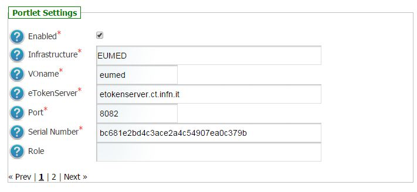
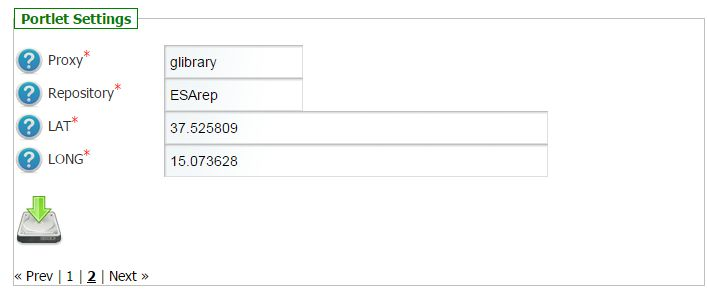
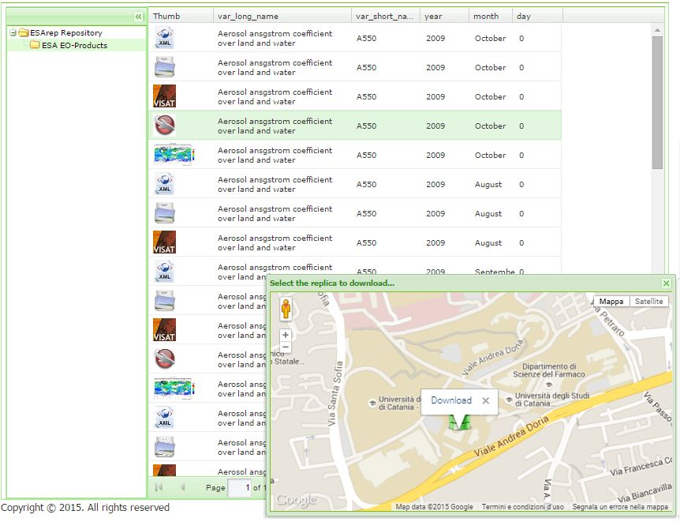

***************************
GLIBRARY-REPO-BROWSER-PORTLET
***************************

.. _gLibrary: https://glibrary.ct.infn.it/

This portlet allow to browse digital repositories using gLibrary_, the Digital Repository System developed by INFN.

============
Installation
============

As soon as the portlet has been successfully deployed on the Science Gateway the administrator has to configure some settings:

1.) To configure a generic e-Infrastructure, the following settings have to be provided:

**Enabled**: A true/false flag which enables or disable the generic e-Infrastructure;

**Infrastructure**: The acronym to reference the e-Infrastructure;

**VOName**: The VO for this e-Infrastructure;

**eTokenServer**: The eTokenServer for this e-Infrastructure;

**Port**: The eTokenServer port for this e-Infrastructure;

**Serial Number**: The MD5SUM of the robot certificate to be used for this e-Infrastructure;

In the following figure is shown how the portlet has been configured to navigate EUMEDGrid-Support digital repositories.

2.) To configure the application, the following settings have to be provided:

**Proxy**: The proxy used to contact gLibrary;

**Repository**: The digital repository to browse;

**LAT**: The default latitude of the EMI-3 DPM Storage Element;

**LONG**: The default longitude of the EMI-3 DPM Storage Element.

In the figure below is shown how the portlet has been configured to browse the **ESArep** digital repository.

============
Usage
============

============
Contributor(s)
============

Please feel free to contact us any time if you have any questions or comments.

.. _INFN: http://www.ct.infn.it/

:Authors:

 Roberto BARBERA - Italian National Institute of Nuclear Physics (INFN_),

 Antonio CALANDUCCI - Italian National Institute of Nuclear Physics (INFN_),

 Giuseppe LA ROCCA - Italian National Institute of Nuclear Physics (INFN_)

